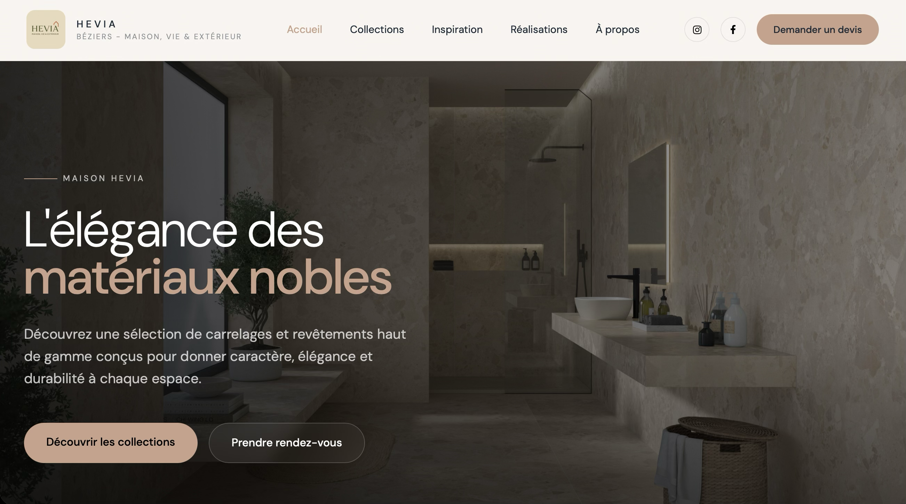
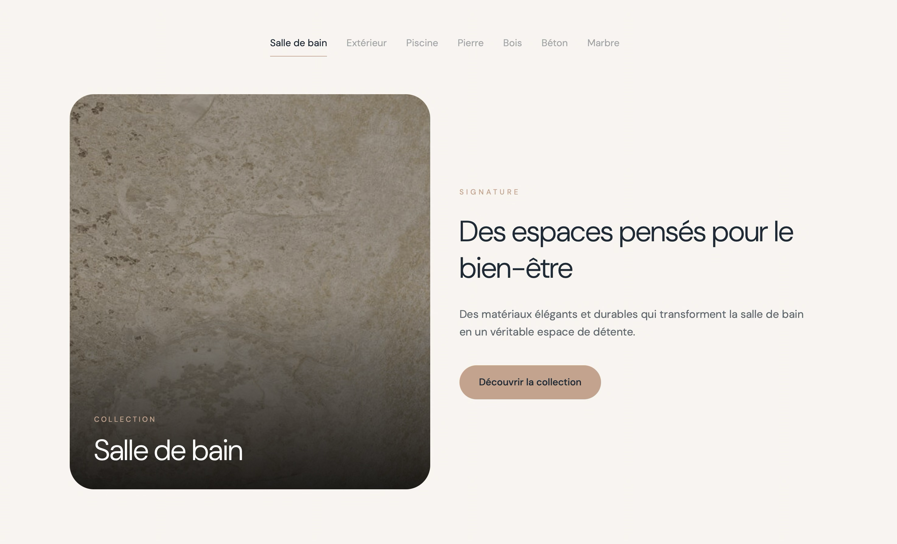
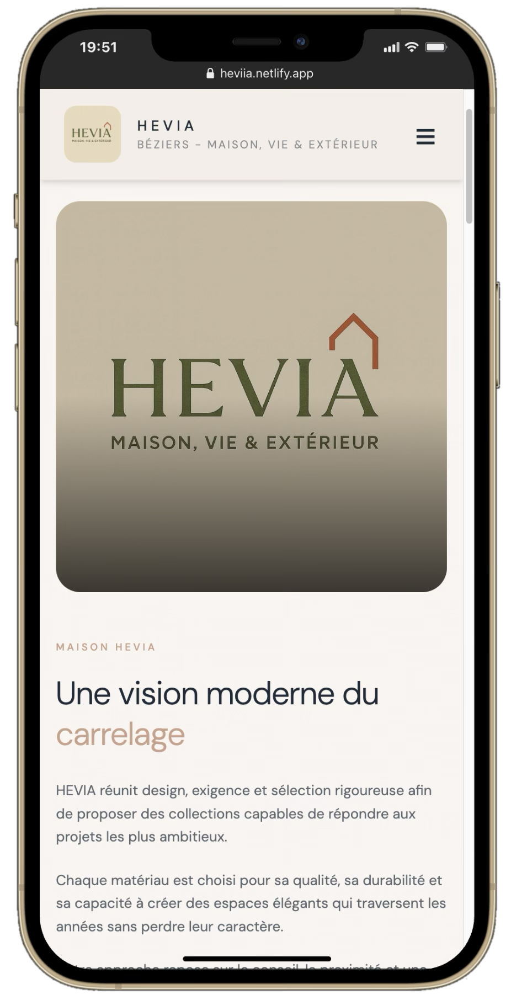

# HEVIA Béziers - Maison, Vie & Extérieur

### Description

Site vitrine développé pour HEVIA, une entreprise spécialisée dans l’aménagement de la maison et des espaces extérieurs à Béziers. Le projet a été conçu pour présenter les différents services proposés, mettre en valeur les réalisations de l’entreprise et offrir une expérience moderne et immersive aux visiteurs.

**[Visiter le site](https://maison-hevia.netlify.app/)**

### Aperçu web

  
  

### Fonctionnalités

- Présentation des collections de carrelage
- Mise en avant des différents styles et finitions
- Présentation des produits et solutions pour l'intérieur et l'extérieur
- Mise en avant des inspirations et réalisations
- Navigation fluide entre les différentes catégories
- Accès aux informations du magasin et aux coordonnées
- Design responsive et adapté aux différents écrans

### Technologies

`React` · `Vite` · `Tailwind CSS` · `Framer Motion` · `Lenis`

### Aperçu mobile

  
  

